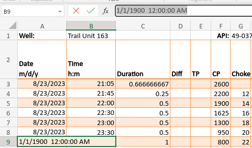
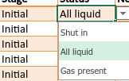
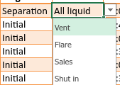

# Flowback
Typically the biggest issues with Flowback Reports fall within the time entry. 

- The date and time are in separate columns because that is what field has requested. For some reason they found having them in a combined field to be more difficult for data entry.
- Most of the rest of the field are numeric only with obvious exceptions
- A lot of fields are calculated

## Date and times
- Verify every date and time is a valid entry. 
  - This has historically been the biggest problem with imports.
  - Pay particular attention to midnight.
    - Midnight is 00:00, not 24:00
    - Midnight is also the start of a new day
    - This may seem obvious, but it seems like it is almost always an issue  
- Make sure all time entry fields do not also have a date included in them
  - 
## Stage and Status
- There are 2 stages
  - Initial - this is used until a well goes to separation for the first time
    - 
  - Separation - once a well goes to separation, **initial cannot be used again** for the entire duration of the report.
    - 
- Things in particular to watch out for
  - Using the initial stage once a well has gone to a separator
- Using he wrong status with the wrong stage
    - Initial/Vent would be an example
  - Hand types values instead of using the drop downs
    - This form is intentionally not locked down so they can deviate from using drop downs
    - The most common 'mistake' would be something like 'shut in' instead of 'Shut in'
    - The values have to be exact or the import routine will fail, and it is case sensitive

