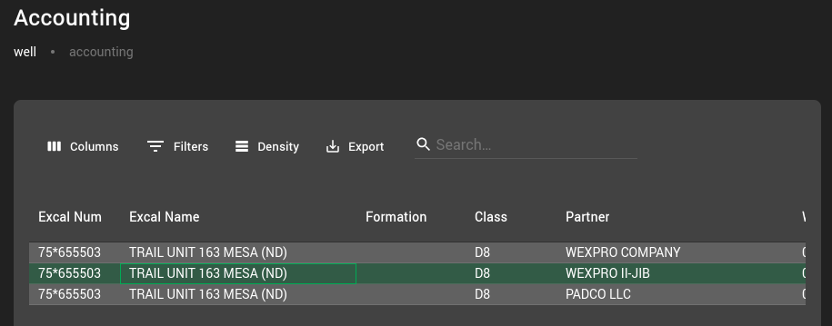
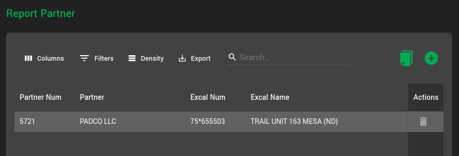
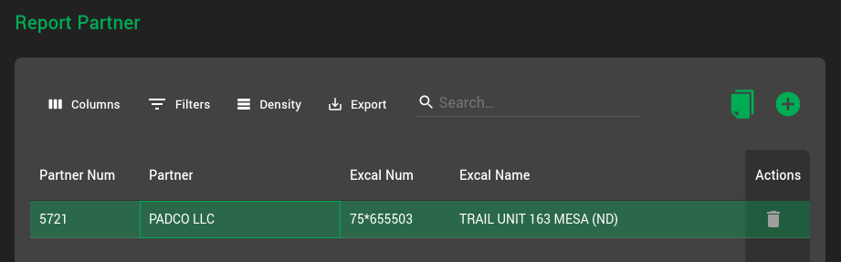
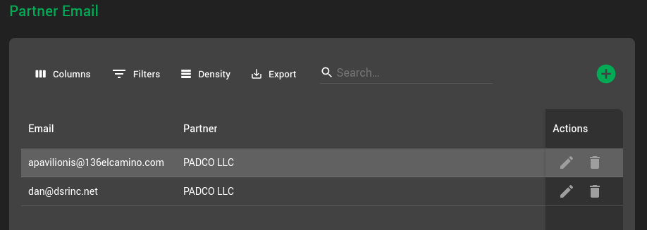
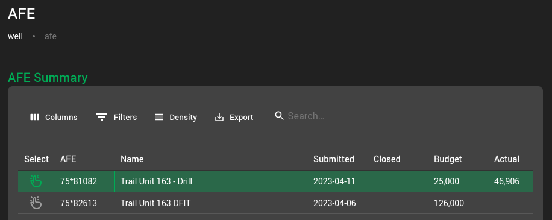
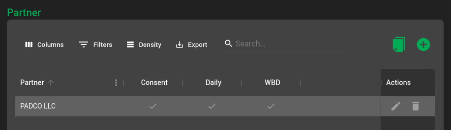
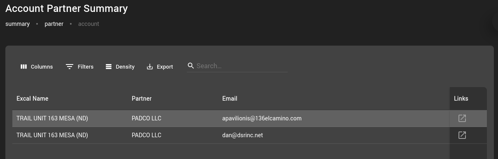
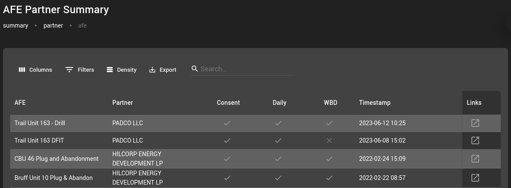

# WexproBI Partner Walk Through

The partner configuration is done under the WexproBI well menu. First, the partners are setup under accounting, including email addresses, and then the actual permissions are configured under AFE.

It is recommended to configure non-consent partners also.

While daily reports are assigned to a specific AFE, WBD (wellbore diagrams) assigned to an API. A partner will receive WBDs until the existing permission is altered, or a newer AFE permission revokes the permission.

## Well Accounting
- <http://slcplwell01/well/accounting>
  
- Select the Excalibur Billing Account the AFE is under by clicking on it
  

- This will load the Report Partners for the account selected. 

### Configuring The Partners

Partners are no longer an automated pull/configuration from Excalibur. However, using the copy buttons will copy all the partners configured in Excalibur. From here, partners can be added or deleted.

This manual configuration will allow automation to be used during drilling and completion also.

### Configure the Partners email addresses
- Select the partner by clicking on it

- Configure the partner email addresses

## AFE
The configuration for the AFE should be pretty straight forward

- <http://slcplwell01/well/afe>

- Select the AFE by clicking on it

- The copy is provided here also
- It will add all partners and give them all permissions

- Daily reports will go out based upon the AFE
- WBDs will be sent out based upon the timestamp when the AFE Partner permissions were added
  - Timestamps are automatically added a record is first added to the Db

## Partner Summary
Summary screens are also provided where all Report Partners and AFE Permissions can be seen / searched

-<http://slcplwell01/summary/partner>

- Account
  - <http://slcplwell01/summary/partner/account>

- AFE
  - <http://slcplwell01/summary/partner/afe>

