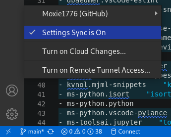
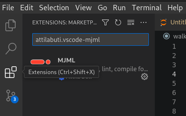
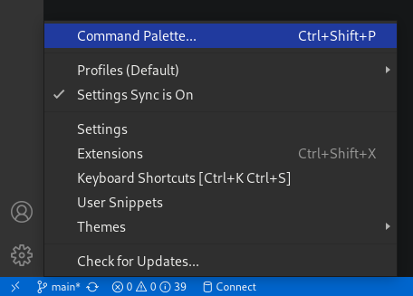
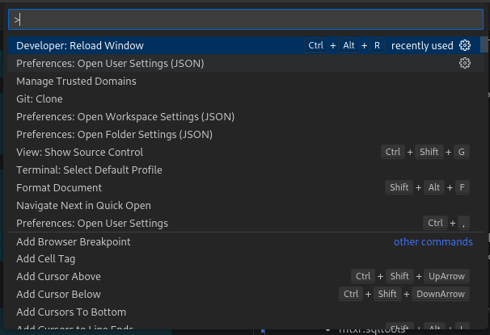

# Setting Up VSCode
This is a suggested setup that will install all the extensions, and configure the coding rules and formatting that enforces the current coding standards.

Current projects / languages that are in use

- Backend
  - Server application that serves data to the frontend website and also include automation routines
    - Python <https://www.python.org/>
      - MiniForge <https://github.com/conda-forge/miniforge>
    - MJML <https://mjml.io/>
- Client_React
  - Frontend website
    - React <https://react.dev/>
    - MUI <https://mui.com/>
    - Next.js <https://nextjs.org/>
    - Echarts <https://echarts.apache.org/en/index.html>
    - Typescript <https://www.typescriptlang.org/>
- GraphQL
  - This will replace web server that serves data to the frontend
  - Python will still hand automation routines
  - This will become an API website that will serve database data to anyone for any purpose 
    - GraphQL <https://graphql.org/>
    - Prisma <https://www.prisma.io/>
    - Nexus <https://nexusjs.org/>
    - Typescript <https://www.typescriptlang.org/>

## Turn on Settings Sync
This will syncronize the VSCode settings anywhere you use it.




## Install Extensions



- attilabuti.vscode-mjml
- dannyconnell.split-html-attributes
- dbaeumer.vscode-eslint
- dsznajder.es7-react-js-snippets
- esbenp.prettier-vscode
- formulahendry.auto-close-tag
- formulahendry.auto-rename-tag
- george-alisson.html-preview-vscode
- GitHub.copilot
- GrapeCity.gc-excelviewer
- infeng.vscode-react-typescript
- kvnol.mjml-snippets
- ms-python.isort
- ms-python.python
- ms-python.vscode-pylance
- ms-toolsai.jupyter
- ms-toolsai.jupyter-keymap
- ms-toolsai.jupyter-renderers
- ms-toolsai.vscode-jupyter-cell-tags
- ms-toolsai.vscode-jupyter-slideshow
- ms-vscode.atom-keybindings
- ms-vscode.live-server
- ms-vscode.test-adapter-converter
- mtxr.sqltools
- mtxr.sqltools-driver-pg
- njqdev.vscode-python-typehint
- PKief.material-icon-theme
- Prisma.prisma
- qwtel.sqlite-viewer
- rvest.vs-code-prettier-eslint
- steoates.autoimport
- streetsidesoftware.code-spell-checker
- TsumiNa.Seti-theme
- usernamehw.errorlens
- yasht.terminal-all-in-one
- yzhang.markdown-all-in-one

## Paste Configuration
- Open the Command Palette
  - ctrl/shift/p
  - Or open from the Manage icon
    - 
- Choose Preferences: Open User Settings (JSON)
  - 
- Paste in the following

```
{
  "cSpell.userWords": [
    "accum",
    "alexa",
    "allo",
    "ampm",
    "anand",
    "Arvl",
    "billto",
    "bopd",
    "bulma",
    "bwpd",
    "codegen",
    "COGCC",
    "Configurator",
    "cortana",
    "dataframe",
    "datagrid",
    "datasources",
    "dotenv",
    "drlg",
    "dropna",
    "Echarts",
    "echoshot",
    "echoshots",
    "excal",
    "flowback",
    "flowtype",
    "Gantt",
    "graphiql",
    "hookform",
    "Iadc",
    "Iconify",
    "ilike",
    "isnot",
    "iterrows",
    "itertuples",
    "Kanban",
    "languagedetector",
    "lifttypes",
    "lightplant",
    "linebreak",
    "mcfd",
    "mcfm",
    "mesaverde",
    "mjml",
    "munge",
    "newlang",
    "nextfield",
    "noapi",
    "notin",
    "notistack",
    "nprogress",
    "oild",
    "oilm",
    "openpyxl",
    "outerjoin",
    "Pason",
    "pbtd",
    "Perfs",
    "persistor",
    "pinnable",
    "pothos",
    "reduxjs",
    "Roboto",
    "scada",
    "setpoint",
    "shutin",
    "sicp",
    "signin",
    "signup",
    "simplebar",
    "siri",
    "sitp",
    "sqlalchemy",
    "stylis",
    "sublink",
    "Tubulars",
    "typegen",
    "typeorm",
    "waterd",
    "waterm",
    "Wellbore",
    "WEXPAT",
    "Wexpro",
    "wexprobi",
    "wexreadonly",
    "wogcc",
    "Workover",
    "Workovers",
    "worktpe",
    "worktype",
    "worktypes",
    "xaxis",
    "Xdays",
    "yday"
  ],
  "editor.codeActionsOnSave": {
    "source.fixAll": true,
    "source.fixAll.eslint": true
  },
  "editor.detectIndentation": false,
  "editor.multiCursorModifier": "ctrlCmd",
  "editor.formatOnPaste": true,
  "editor.formatOnSave": true,
  "editor.formatOnType": true,
  "editor.foldingHighlight": false,
  "editor.inlineSuggest.enabled": true,
  "editor.suggestSelection": "first",
  "editor.tabSize": 2,
  "eslint.validate": [
    "javascript",
    "javascriptreact",
    "html",
    "typescriptreact"
  ],
  "files.autoSave": "onFocusChange",
  "git.terminalAuthentication": false,
  "github.copilot.enable": {
    "*": true,
    "plaintext": true,
    "markdown": false,
    "scminput": false
  },
  "http.proxyStrictSSL": false,
  "http.systemCertificates": false,
  "[html]": {
    "editor.defaultFormatter": "esbenp.prettier-vscode"
  },
  "[javascript]": {
    "editor.defaultFormatter": "esbenp.prettier-vscode"
  },
  "[json]": {
    "editor.defaultFormatter": "esbenp.prettier-vscode"
  },
  "json.maxItemsComputed": 7000,
  "[jsonc]": {
    "editor.defaultFormatter": "esbenp.prettier-vscode"
  },
  "jupyter.askForKernelRestart": false,
  "notebook.lineNumbers": "on",
  "[python]": {
    "editor.codeActionsOnSave": {
      "source.organizeImports": true
    }
  },
  "python.analysis.completeFunctionParens": true,
  "python.experiments.enabled": false,
  "python.formatting.autopep8Args": [
    "--aggressive",
    "--indent-size=2",
    "--max-line-length=80",
    "--ignore=E111,E114,E121,E123,E126,E128,E226,E24,E701,E704,E722,W503,W604,W614,W690"
  ],
  "python.formatting.provider": "autopep8",
  "python.languageServer": "Default",
  "python.linting.flake8Args": [
    "--ignore=E111,E114,E121,E123,E126,E128,E226,E24,E701,E704,E722,W503",
    "--max-line-length=80"
  ],
  "python.linting.flake8Enabled": true,
  "python.linting.pylintArgs": ["-–optimize-ast=y"],
  "python.linting.pylintEnabled": false,
  "[typescript]": {
    "editor.defaultFormatter": "esbenp.prettier-vscode"
  },
  "telemetry.telemetryLevel": "off",
  "terminal.integrated.defaultProfile.windows": "PowerShell",
  "terminal.integrated.inheritEnv": false,
  "[typescriptreact]": {
    "editor.defaultFormatter": "esbenp.prettier-vscode"
  },
  "workbench.activityBar.visible": true,
  "workbench.colorTheme": "Seti",
  "workbench.editor.enablePreview": false,
  "workbench.editor.highlightModifiedTabs": true,
  "workbench.iconTheme": "material-icon-theme",
  "javascript.preferences.quoteStyle": "single",
  "typescript.preferences.quoteStyle": "single",
  "prettier.jsxSingleQuote": true,
  "prettier.singleQuote": true,
  "[vue]": {
    "editor.defaultFormatter": "esbenp.prettier-vscode"
  }
}

```
